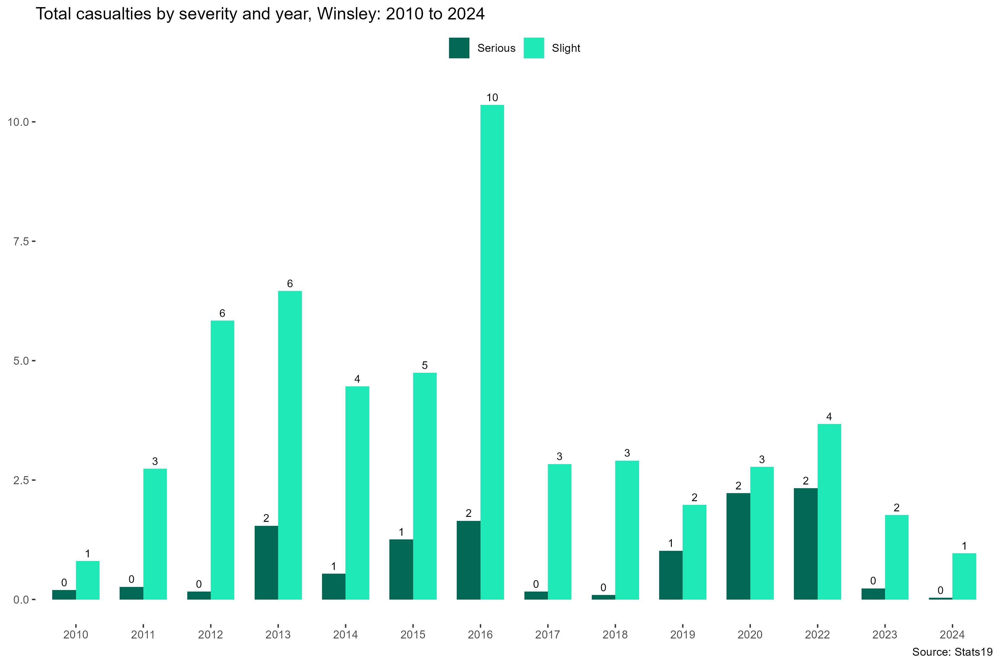
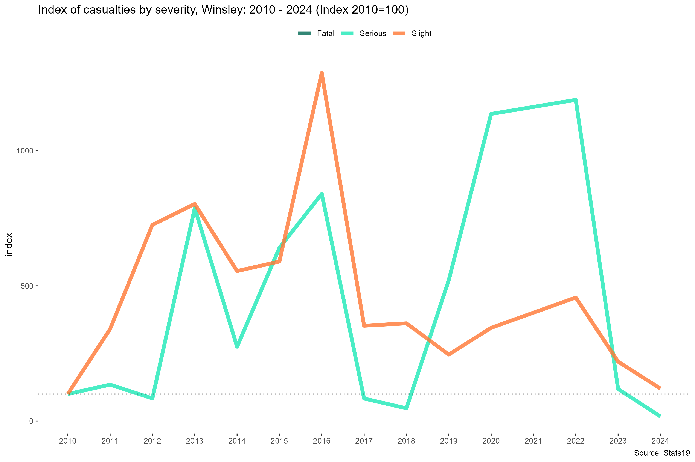
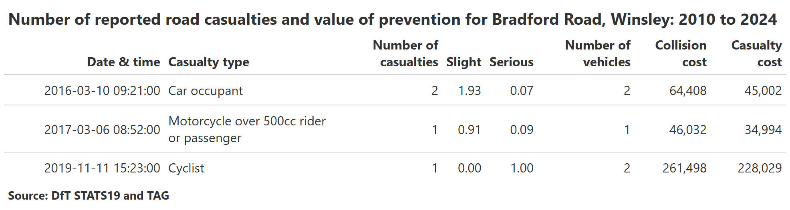
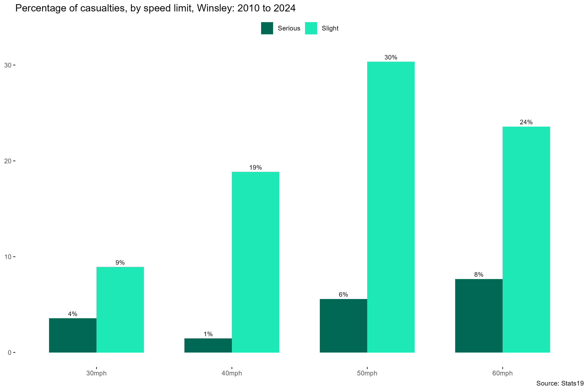
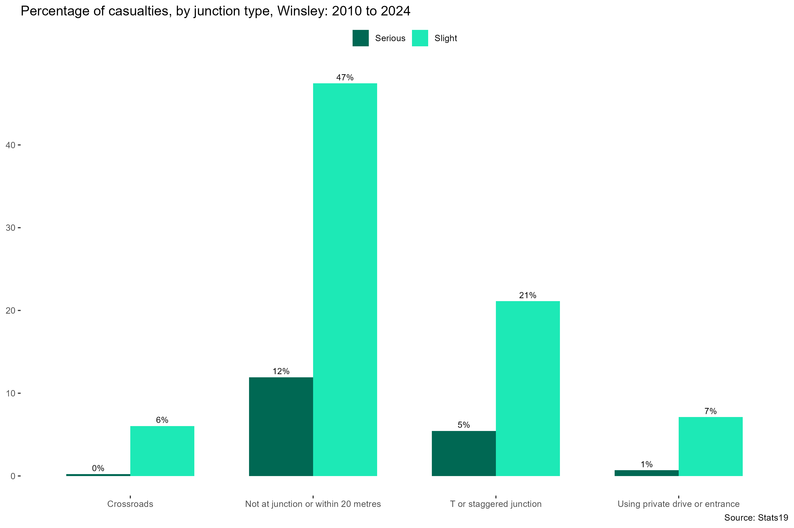
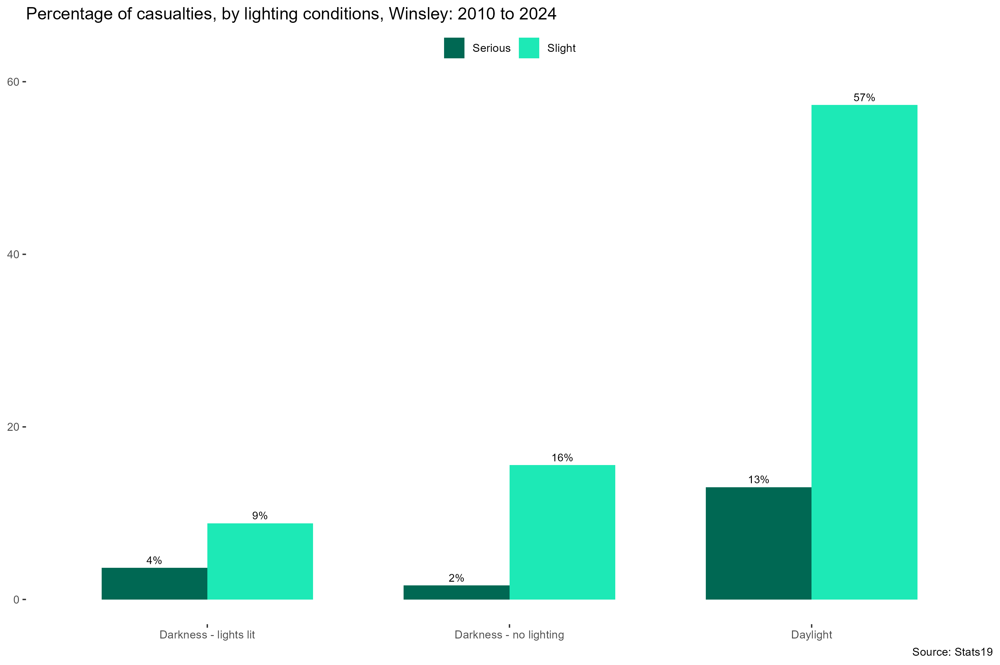
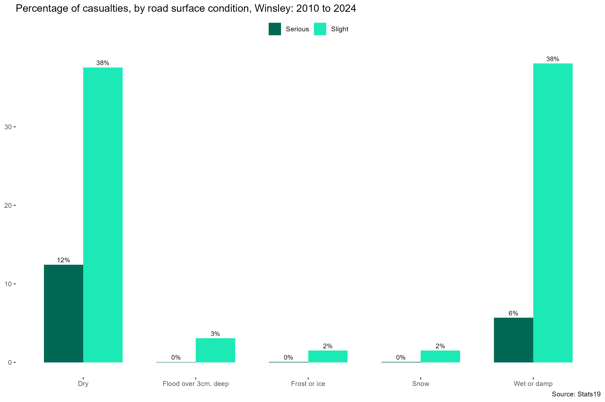

# Winsley Parish STATS19 Analysis 2010-2024

# Introduction

This is a break down of the DfT Stats19 data for the Parish Council of
Winsley, Wiltshire shown by the orange line in the figure below.

The period of 2010 to 2024 has been chosen as the [cost
data](https://assets.publishing.service.gov.uk/media/68d421cc275fc9339a248c8e/ras4001.ods)
runs for these years.

The numbers quoted in this report and the plots and charts are fully
reproducible in the script “analysis” in [this
repository](https://github.com/BlaiseKelly/winsley_stats19). Many of the
Serious and Slight figures might be given as decimals, i.e. 0.8 Serious
and 0.2 Slight. This is because injuries are reclassified
retrospectively according to the [MAIS 3+
score](https://assets.publishing.service.gov.uk/media/5a7f62b840f0b62305b86d3b/rrcgb2015-03.pdf)
to enable fair comparisons between casualties and also enable
comparisons between countries (e.g. the WHO only considers fatal
collisions in its reporting because so many countries don’t report
serious and slight injuries due to difficulties in documentation
training etc.)

## Trends

The chart below shows the total casualties by severity between 2010 and
2024.

and the change year on year relative to 2010.

 \## Location The location of the casualties is
shown below. Different casualty types are given a unique shape and
coloured to aid distinction on the map.

 And the same plot as above but sized by
severity.

 All the casualties OSM links

 \## DfT avoided cost methodology

The DfT’s RAS4001 dataset provides annual estimates of the economic
value of preventing road collisions and casualties in Great Britain.
Developed from long-standing DfT methodologies dating back to the 1990s,
it combines collision and casualty data from the STATS19 reporting
system with cost estimates from the [TAG data
book](https://www.gov.uk/guidance/transport-analysis-guidance-tag),
covering human costs (pain, suffering, lost life), lost economic output,
medical expenses, and property damage. Values are updated regularly to
reflect inflation and changes in data collection. The dataset reports
average and total costs per casualty and per collision by severity
(fatal, serious, slight, and damage-only). It is widely used by
government and local authorities to assess the economic burden of road
traffic collisions and to support cost-benefit analyses of safety
interventions.

The value in the table RAS4001 have been matched with the casualty data
for the period 2010-2024 and summarised in the table and plot below.

 The total value of prevention for the period comes
to £7,645,665, an average of just over £500,000 per year.

For Bradford Road alone the cost of the 3 collisions in this period
comes to £616,050, broken down in the table below.
 \# Extra data Breaking down the total
casualties in this period by some other variables

## Age and sex

## Casualty type

## Speed limit

## Junctions

 \## Weather conditions
 \## Lighting 

## Road surface

